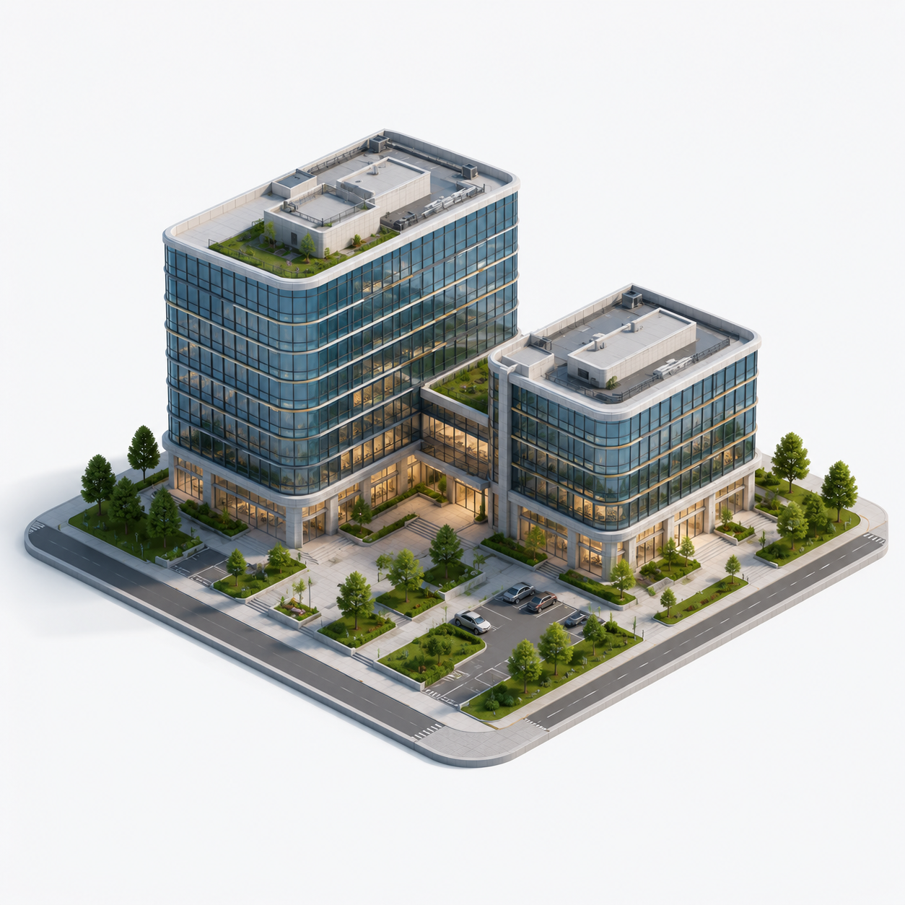

<div align="center">



# AUGA

**Davlat aktivlarini boshqarish tizimi**

MIB'dan qabul · Xavfsizlik va monitoring · Smart Access · Masofaviy ko'rik · Sotuv · Doimiy arxiv

[Jonli tizim](https://farhodmuxtorov17-stack.github.io/auga-dashboard/login.html) ·
[Modullar](#modullar) · [Rollar](#rollar-va-huquqlar) · [Arxitektura](#arxitektura)

</div>

---

Musodara qilingan obyekt tizimga MIB'dan kirib keladi va undan hech qachon chiqib ketmaydi:
qabul → qurilmalar o'rnatish (kamera, FaceID, IP-reyestr) → doimiy monitoring → xaridor uchun
masofaviy ko'rik → sotuv → o'chirilmas arxiv. Har bir bosqich — alohida modul, har bir amal —
rol huquqlari bilan nazorat qilinadi.

## Ishga tushirish

```bash
git clone https://github.com/farhodmuxtorov17-stack/auga-dashboard.git
cd auga-dashboard
python -m http.server 8765
# → http://localhost:8765/login.html
```

Qurilish bosqichi talab qilinmaydi — tizim istalgan statik serverda ishlaydi.
Kirish `login.html` orqali; rol o'sha yerda tanlanadi.

## Rollar va huquqlar

Huquqlar ikki qatlamda tekshiriladi: **sahifa** darajasida (taqiqlangan bo'lim — 403 ekrani)
va **amal** darajasida (rolga taqiqlangan tugma ko'rsatilmaydi). Har bir rol o'z boshqaruv
paneliga ega; portfel xaritasi hammasida funksional.

| Rol | Bo'limlar | Cheklovlar |
|---|---:|---|
| **Administrator** | 17 | to'liq huquq, foydalanuvchilar va audit jurnali |
| **Operator** | 14 | moliyaviy hisobotlar yopiq |
| **Rahbar** | 13 | monitoring — faqat ko'rish; qurilma/eshik amallari yo'q |
| **Texnik xodim** | 9 | hujjatlar, moliya va sotuv yopiq |

`foydalanuvchilar.html` dagi huquqlar matritsasi sahifa qo'riqchisi ishlatadigan ayni
`ROL_RUXSAT` jadvalidan chiziladi — interfeys siyosatdan ajralib keta olmaydi.

## Modullar

| Bosqich | Sahifa | Mazmun |
|---|---|---|
| Boshqaruv paneli | `index.html` | 4 ta rolga mos panel, klaster-xarita, KPI |
| Aktivlar reyestri | `aktivlar.html`, `aktiv.html` | qidiruv, filtrlar, obyekt kartasi 360°, qavat navigatsiyasi |
| MIB'dan qabul | `mib-qabul.html` | majburiy hujjatlar validatsiyali 4 bosqichli sehrgar |
| Qurilmalar | `qurilma-ornatish.html`, `qurilmalar.html` | provizioning, diagnostika, IP-reyestr |
| Monitoring | `monitoring.html`, `hodisalar.html` | kameralar, ogohlantirishlar, hodisalar kanbani |
| Smart Access | `smart-access.html`, `jonli-tashrif.html`, `kirish-voqealari.html` | FaceID, turniketlar, kirish jurnali |
| Masofaviy ko'rik | `masofaviy-korik.html` | xaridor uchun jonli kameralar va qavat rejasi |
| Shartnomalar | `shartnomalar.html` | to'lov jadvallari, muddat nazorati |
| Sotuv va arxiv | `sotuv.html`, `arxiv.html` | bosqichli pipeline, o'chirilmas arxiv |
| Hisobotlar | `hisobotlar.html`, `hisobotlar-markazi.html` | moliyaviy KPI, dinamika, eksport markazi |
| Xaritalar | `xaritalar.html` | O'zbekiston bo'ylab hududiy taqsimot |
| Ma'muriyat | `foydalanuvchilar.html`, `sozlamalar.html` | rollar matritsasi, audit jurnali |

## Arxitektura

**Joriy bosqich** — to'liq interaktiv etalon (reference implementation): 30 ekran, sof
HTML/CSS/JS, tashqi qaramliksiz (yagona istisno — Leaflet xarita kutubxonasi; tarmoq
bo'lmasa sahifa ishlashda davom etadi). Har bir ekran o'z faylida — komponentlarga
ko'chirish izolyatsiyalangan holda bajariladi.

**Maqsadli stek** (TZ bo'yicha):

```
Frontend   Vue 3 · Nuxt 3 · Tailwind CSS
Backend    Python · Django REST Framework
           obyekt darajasidagi huquqlar (§7) · audit · fayl xizmati
```

Etalon — ko'chirish shartnomasi: ekranlar, holatlar va huquq qoidalari allaqachon
aniqlangan va tekshirilgan.

## Sifat nazorati

Barcha ko'rsatkichlar qayta tekshirish mumkin bo'lgan tartibda olingan:

- 30 sahifa × 4 rol = **120 kombinatsiya**: konsol xatosi — 0, bo'sh sahifa — 0
- RBAC: sahifa darajasida **116/116** siyosatga mos; amallar darajasi ham qamrab olingan
- Moslashuvchanlik: 480px va undan keng ekranlarda gorizontal toshish — 0
- Interfeys elementlari auditi: 236 boshqaruv elementi tasniflangan va haqiqiy
  funksiyaga keltirilgan
- Barcha sanoq va foizlar ma'lumot massivlaridan chiqariladi, qo'lda yozilmaydi

Tizimdagi barcha ma'lumotlar — namoyish uchun.

## Kelgusi bosqichlar

1. Nuxt 3 komponentlariga ko'chirish
2. DRF: `Aktiv · Shartnoma · Qurilma · Hodisa` modellari, obyekt huquqlari, audit
3. Smart Access kontrollerlari bilan integratsiya (FaceID, turniket)
4. Mobil moslashuv (< 480px)

---

<div align="center"><sub>Ichki loyiha · Barcha huquqlar himoyalangan</sub></div>
